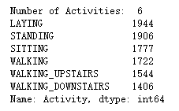
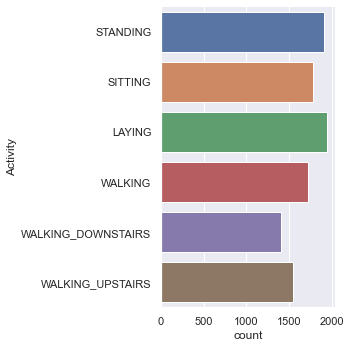
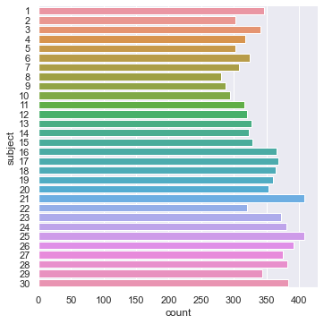
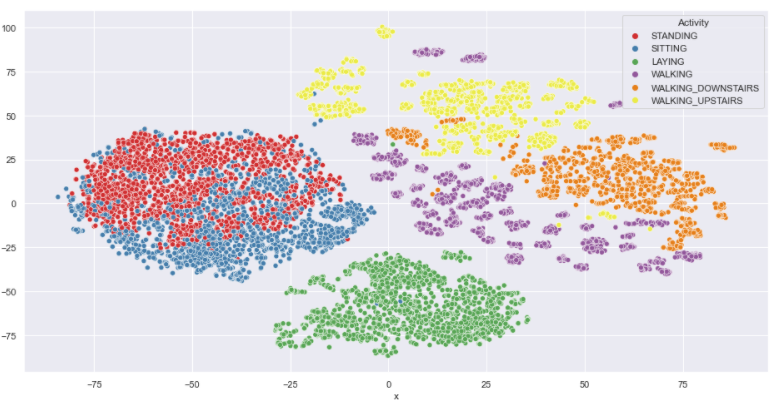
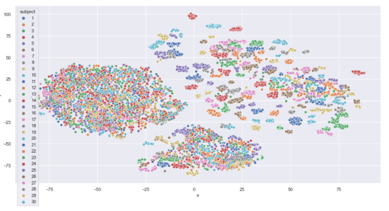
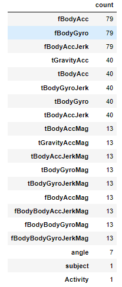
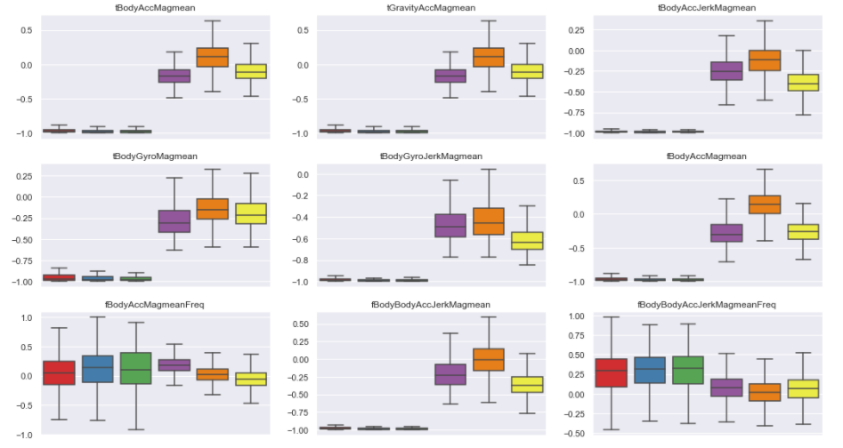
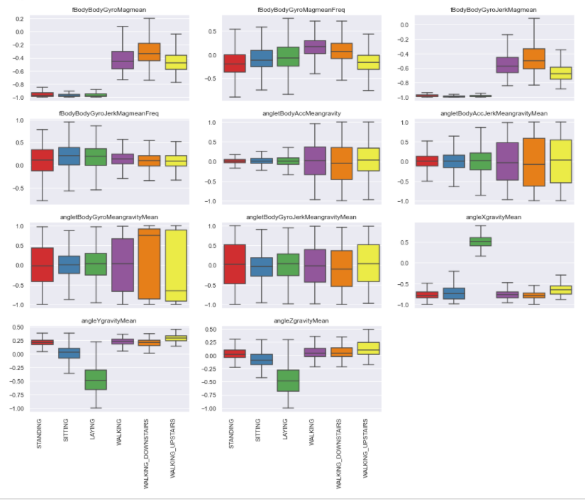

# SC1015 Data Science & Artificial Intelligence Mini Project
# How much user information can smartphone sensors reveal? Can we prevent it by protecting partial data?
SC16 --- Chen Yi, Gong Zerui, Zeng Xunyi
dataset: https://www.kaggle.com/datasets/uciml/human-activity-recognition-with-smartphones

subproblem 1: What user information can we exploit from the dataset?

subproblem 2: How to prevent personal information leak by preventing partial data?

## 1. [Exploratory Data Analysis](https://github.com/XunyiiZ/SC1015-Project/blob/6224ba8f602d3e3a9e8cb3cf64d17ae136a1bbf4/Part%201.%20EDA.ipynb)
#### a. About dataset:
> 30 study participants performing activities of daily living (ADL) while > > carrying a waist-mounted smartphone with embedded inertial sensors > (accelerometer and gyroscope). The sensor signals (accelerometer and gyroscope) were pre-processed by applying noise filters and then sampled in fixed-width sliding windows of 2.56 sec and 50% overlap (128 readings/window).

#### b. Data Cleaning
1. There are 0 NaN or Null value in the dataset
2. The data is quite balanced in both activities and participants

#### c. explore the dataset
1. description
> prefix 't' in those metrics denotes time.
> suffix 'XYZ' represents 3-axial signals in X , Y, and Z directions.
> 'f' denotes frequency
> In physics, jerk is the rate at which an object's acceleration changes with respect to time. It is a vector quantity (having both magnitude and direction). Jerk is most commonly denoted by the symbol j and expressed in m/s^3 (SI units) or standard gravities per second (g_0/s).

2. activities in dataset

3. participants in dataset
Number of Participants: 30

#### d. TSNE(t-distributed stochastic neighbor) for visualization data visualization

Most activities can be separated very well

From right corner, we can see that participants are also separable in dynamic moving.
#### e. feature exploration
1. The features seem to have a main name and some information on how they have been computed attached. Grouping the main names will reduce the dimensions for the first impression.

2. Use all "mag-mean" data to see how they separate data differently
 
From these figures, we can see that the magnitude of the accelerometer can separate movement from stationary activities pretty well, but the frequency data does not help much.

## 2. What can we explore from smartphone sensor data?
### 2.1 Classifying activities

- [logistic regression](https://github.com/XunyiiZ/SC1015-Project/blob/6224ba8f602d3e3a9e8cb3cf64d17ae136a1bbf4/Part%202(a).%20Logistic%20Regression%20(classifying%20activities).ipynb)
- [random forest](https://github.com/XunyiiZ/SC1015-Project/blob/6224ba8f602d3e3a9e8cb3cf64d17ae136a1bbf4/Part%202(b).%20RandomForest(Classifying%20Activities).ipynb)
- [light-gbm](https://github.com/XunyiiZ/SC1015-Project/blob/6224ba8f602d3e3a9e8cb3cf64d17ae136a1bbf4/Part%202(c).%20LightGBM(classifying%20activities).ipynb)

We train these 3 models and also use randomizedSearchCV for hyperparameter tuning. The accuracy for each model is all abve 0.9

### 2.2 classifying participants

- [light-gbm](https://github.com/XunyiiZ/SC1015-Project/blob/6224ba8f602d3e3a9e8cb3cf64d17ae136a1bbf4/Part%202(d)%20Light-GBM(clasifying%20participants).ipynb)
We also trained light-gbm for classifying participants, the accuracy of model is

### 2.3 personal information exploration

we decided to take one step further, to see what more information we can reveal from the data. 
In this part, we used the [Singular-Spectrum Analysis notebook](https://www.kaggle.com/jdarcy/introducing-ssa-for-time-series-decomposition) (SSA) from [jdarcy](https://www.kaggle.com/jdarcy) created by [jdarcy](https://www.kaggle.com/jdarcy) 
SSA enables us to extract the main components of the waking style of participants using the euclidean norm of the accelerometer axes: x, y, and z.  In this way, we can convert our sensor data to a time-series plot.

Then, if we fit a sin curve to the time-series graph, we shall be able to find out the step frequency of a person

After the initial fitting, we found that there seems to be a pace change during the experiment, this is possibly due to two different trial experiments. So we managed to separate the timeseries and re-fit the sin-curve. Here’s what we got:

So we successfully showed one can actually exploit a lot from these two sensor datas. Not only the activities the users are doing, but also the identity of the user. Moreover, one can even calculate and find out the tranduser’s walking pattern, like pace or step frequency.

## 3. Can we prevent personal information leak by preventing partial data?

### 3.1 Drop main feature group one by one

Our intuitive solution is to drop the main features that we have grouped earlier in EDA part one by one. As we can see, the performance in 3 models is still above 0.9, which is not what we expected.

### 3.2 Drop 10%, 30%, 50% of important features

In the EDA part, we also have seen that different features are able to separate activities to various degrees with some clearly differentiating the activities and others not so much.
This gives us the idea to find the sorted list of important features in each model, we successively drop  top 10 percent, top 30 percent and top 50 percent of the important features, however, the accuracy for each model still remained very high.

### 3.3 Drop one of sensor information
Then we try to hide all information of 1 sensor to see if the model will be affected.
, thus we drop all the features that are recorded by accelerometer  first, then we drop the features recorded by gyroscope, Surprisingly, the performance for each model are still quite good, with accuracy above 0.8

Base on our findings, it seems that even if we completely remove one of the sensor, the data collected from the other sensor can still be used to recognise user’s activities to a relatively high accuracy.·. Hence, it is impossible to prevent this kind of data from leaking by partially hiding some of the sensor parameters.

## 4. Conclusion
In today’s world, data privacy is being valued more than ever. If apps can process the accelerometer and gyroscope data like we did in our project, it is easy for them to figure out the user’s preference in terms of daily activity. If this kind of information become easily accessible to E-commerce apps, they can carry out Target advertising for every user based on their individual trait. This significantly reduced the targeted advertising cost for firms, thus, these kinds of data would be valuable.

Also, most of us carry our smartphones around every day and every minute, it is almost terrifying to think of a hacker could know what we are doing at any time he wants.

To ultimately prevent the privacy leak related to human activity data, based on our findings in this project. We suggest forbidding access to these sensors from unnecessary apps. After all, all the insights we explored are extracted from only 2 sensors, let’s not forget how many other permission you gave when you rush to press every ALLOW button when you download an app

